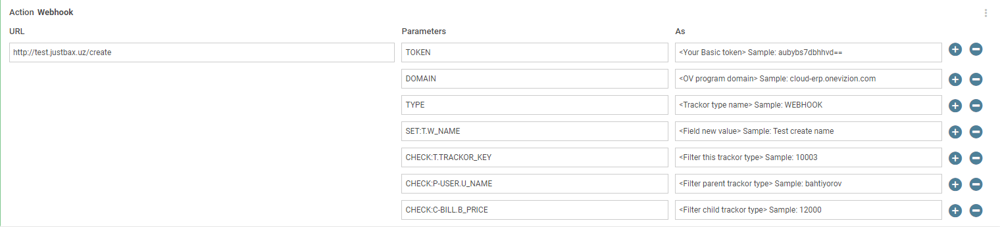
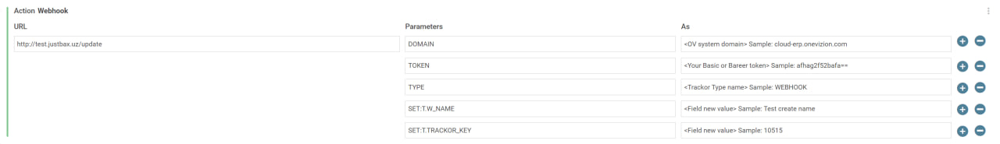

## OneVizion Webhook

**Description:** This webhook can be used within Qrvey Automations to schedule or trigger actions that create or update data in a Trackor within any OneVizion system.

### Usage

To use this webhook, follow these steps:

1. Create a Trackor and set data for its fields as needed.

   

2. Update a Trackor with conditions.

   

**Mandatory Parameters:**

- `DOMAIN`: Domain name of the OneVizion system.
- `TOKEN`: Basic token from the OneVizion system's API. (Will change to Bareer in next update)
- `TYPE`: The name of the Trackor type for which you want to create a new Trackor.

**Usage of Trackors and Field Names for Commands:**

- `T.FIELDNAME`: Refers to the `FIELDNAME` field within the specified `TYPE` Trackor set in the mandatory parameters.
- `P-TYPE.FIELDNAME`: Refers to a child Trackor's `FIELDNAME` within the `TYPE` Trackor.
- `C-TYPE.FIELDNAME`: Refers to a parent Trackor's `FIELDNAME` within the `TYPE` Trackor.

**Available Commands:**

- `SET`: Use this command to set data in a field. Always use it with `T.FIELDNAME`.
- `CHECK`:
  - For `Create` this command is used to relate newly created Trackors to their parent and child Trackors. You can use it with `T.FIELDNAME`, `P-TYPE.FIELDNAME`, and `C-TYPE.FIELDNAME`.
  - For `Update`, this command is used to check the equality of field values. You can use it with `T.FIELDNAME`, `P-TYPE.FIELDNAME`, and `C-TYPE.FIELDNAME`.

**You can use my test server to test automation - test.justbax.uz**
